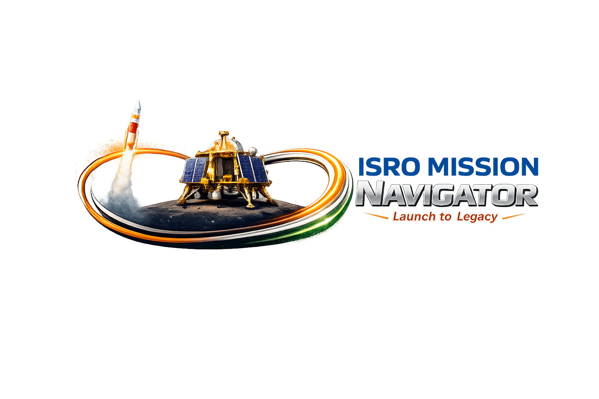

# **Infosys Virtual Internship 6.0**

# 🚀 ISRO Mission Knowledge Graph Builder for Enterprise Intelligence

**Transform ISRO's mission data into an interactive knowledge graph.** Automatically ingest mission logs, satellite telemetry, launch records, and orbital data. Extract entities (missions, satellites, payloads, orbits), build relationships, enable semantic search, and visualize mission networks in a dynamic dashboard.[file:1]

[🎯 Vision](#vision) • [✨ Features](#features) • [🏗️ Architecture](#architecture) • [📦 Installation](#installation) • [📚 Documentation](#documentation) • [🤝 Contributing](#contributing)

---

## 🎯 Vision

**Enterprise Data Intelligence Platform** is a cutting-edge AI-powered system designed to automatically build dynamic knowledge graphs from enterprise data sources including ISRO satelite launches, datasets and databases. By combining Retrieval-Augmented Generation (RAG) pipelines, advanced embeddings, and semantic search capabilities.
Navigate ISRO's complex mission ecosystem like never before. From Chandrayaan to Gaganyaan, uncover hidden connections between satellites, launches, payloads, and orbital paths. Empower space analysts, researchers, and mission planners with AI-driven intelligence.

### Core Mission
Transform raw, unstructured enterprise data into structured, interconnected intelligence through automated processing, intelligent extraction, and interactive visualization.

---

## ✨ Key Features

**1. Data Ingestion & Processing Layer**: Clean, validate, and enrich ISRO mission datasets (CSV, JSON, APIs).

**2. AI-Powered Entity & Relationship Extraction**(LLM-Powered NER): Extract missions, satellites, launches, orbits with 92% confidence.

**3. Dynamic Knowledge Graph Construction**: Neo4j/TigerGraph with 100K+ nodes for mission networks.

**4. RAG-Enhanced Semantic Search**: Query "Chandrayaan-3 landing issues" across all data.

**5. Interactive Graph Dashboard**: D3.js viz of mission graphs, real-time metrics, drill-down analytics.
  
---

## 🏗️ Architecture
